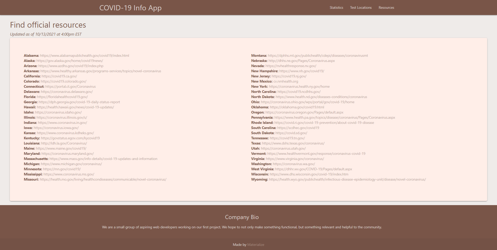

# COVID-19-app
*A collaborative project between Reiner Bonsol, Andrew D'Ambrosio, and Morgan Henning*

---

## Index
- [Elevator Pitch](#elevator-pitch)
- [Concept](#Concept)
- [Process](#Process)
- [Challenges vs. Sucesses](#challenges-vs-successes)
- [Demo Gifs/Photos](#demo-gifsphotos)
- [Future Development](#future-development)
- [Links](#Links)
## Elevator Pitch
We’ve aimed to relieve stress when researching COVID-19 by offering a simple, accurate site where people can check the latest updates without being bombarded with fake news, the wrong kind of information, and stressful links. This is simply an easy to navigate site where users can access accurate statistics and resources without any unwanted extra content.

## Concept
This site is an easy, nonabrasive way to find reliable and up-to-date information regarding COVID-19 statistics, testing locations, and resources. We developed this site as it seemed like the most obvious need in our current climate. We’re all attending class remote due to COVID-19, and we all noticed a shortage in reliable sources for information, so we aimed to create one ourselves.

User Story:
- **AS A** user looking for statistical information regarding the COVID-19 pandemic
- **I WANT** to be able to obtain various bits of information
- **SO THAT** I can be better informed of what is happening in the world and provide testing centers in the state of the user’s choosing

## Process
- We made a base HTML page with CSS, including aspects from Bootstrap, Materialize, and Moment.js
- We used 3 separate API’s to populate the data for our site, and Postman to analyze response
- Morgan primarily built HTML/CSS, Reiner primarily built Javascript, and Andrew assisted with both

## Challenges vs. Successes
| Challenges | Successes |
| ----------- | ----------- |
| Learning how to use Materialize | Correctly implementing Materialize |
| Being too broad with AJAX requests/responses since each API returned 80+ responses | Gaining an understanding of AJAX endpoints |
| Appending all of the information onto the table and cards | Creating an idea right off the bat that was narrow enough to specify intent, but broad enough to change if needed |
| Learning how to use different branches in GitHub | Working as a team to make consistent progress and provide constructive criticism to each other |

## Demo Gifs/Photos
Home Page

Mobile Responsive Nav Bar

Statistics Page

Test Locations Page

Resources

## Future Development
- We could definitely expand and refine this project easily in the future
- We can change and add new APIs as they are created, add new sources, and add new features while maintaining the calming simplicity that the site offers

## Links
- [Repo Link](https://github.com/zimcrom/COVID-19-app)
- [Site Link](https://zimcrom.github.io/COVID-19-app/)

